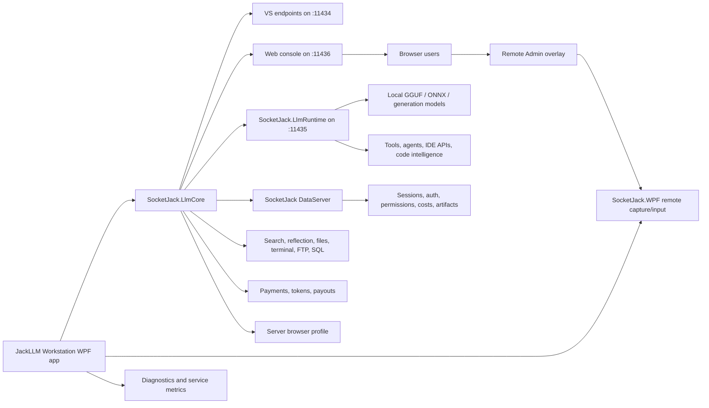

# JackLLM Workstation


JackLLM Workstation is the desktop control center for SocketJack.LlmRuntime: a local AI runtime, generation-node host, agent workstation, and OpenAI-compatible / Visual Studio-compatible bridge for local tools, browsers, and remote clients.

It is part diagnostics dashboard, part runtime manager, part reverse proxy, part browser chat host, part billing station, and part admin console. JackLLM Workstation wraps SocketJack.LlmRuntime with a rich web UI, model management, tool approval, agent sessions, service health, permissions, server-browser metadata, and SocketJack.WPF remote control.

## Version and Stack

| Component | Version | Target |
|---|---:|---|
| JackLLM Workstation WPF | `2026.0` | `net8.0-windows7.0` |
| JackLLM Workstation Linux host | `2026.0` | `net8.0` |
| JackLLM Workstation Linux `.deb` | `1:26.0.1` | Debian-compatible package version for the 2026 line |
| SocketJack.LlmRuntime | `2026 platform` | `net8.0` |
| SocketJack core | `2026.0` | `.NET Standard 2.1` |
| SocketJack.WPF | `2026.0` | `net8.0-windows7.0`, `net10.0-windows7.0` |

The GUI is built for the SocketJack 2026 platform line: the proxy, WPF remoting, web console, server browser, database, payments, and observability surfaces now evolve together under the year-based version scheme. The Debian package uses `1:26.0.1` so Linux package managers get a compact compatible version while still upgrading cleanly from earlier `2026.0.x` packages.

## What's New

| Area | New capability |
|---|---|
| Server browser profile | Publish model, hardware, tool, storage, pricing, uptime, and payment metadata for remote clients. |
| Remote model leasing | Select remote JackLLM Workstation model servers through the Copilot duplicator and lease APIs while keeping local endpoints stable. |
| Finance workspace | Stripe checkout, connected account, payout, token balance, and usage-cost records are surfaced through the web UI. |
| Token-rate requests | Users can request rate changes, while admins can approve, deny, and audit those requests. |
| Trust and abuse | Admin review surfaces track trust cases, interventions, and permission risk signals. |
| Observability | Event streams, service health, database counts, hardware metrics, security posture, pending approvals, and Prometheus-style metrics are exposed from the console. |
| Remote session files | Session artifacts can be cloned, watched, canceled, and cleaned up from a managed local root. |

## SocketJack.LlmRuntime

SocketJack.LlmRuntime is the local model and agent runtime behind JackLLM Workstation. It hosts local models, exposes OpenAI-compatible APIs, manages tools, and provides the workstation's IDE/agent surfaces without requiring a datacenter-hosted provider.

| Capability | What SocketJack.LlmRuntime provides |
|---|---|
| Local model runtime | GGUF model scanning, metadata, model load/unload, model download status, and local model roots under `Models`. |
| Backend selection | CPU, CUDA 12, Vulkan, DirectML runner support, and native SockJackDml Direct3D 12/DirectML probe paths. |
| OpenAI-compatible APIs | `GET /v1/models`, `POST /v1/chat/completions`, SSE streaming chat, tool-call parsing, and compatibility routes. |
| Tool registry | Public/private/internal tools with JSON schemas, OpenAI and MCP-shaped export, approval modes, secrets, audit history, and scoped permissions. |
| Built-in tools | Approved local desktop automation, terminal/file tools, sandboxed file edits, and SocketJack-native tool execution. |
| Agent sessions | Durable agent sessions, plan/apply/review state, check loops, sandbox profiles, approved commands, and autonomous model-backed runs. |
| IDE and Copilot parity | Inline completion, next edit, Ask/Edit/Agent/Plan modes, checkpoints, rollback, prompt files, custom instructions, MCP-shaped context, BYOM/BYOK routing, and workspace indexing/search. |
| Code intelligence | Symbol graphs, dependency graphs, refactor/migration plans, missing-test exploration, profiling plans, architecture review, documentation sync, model evaluation planning, and context-budget optimization. |
| GitHub/team workflows | Repository inspection, issue/PR task starts, branch/commit/PR helpers, draft PR jobs, summaries, diff review, Actions diagnostics, and audit logs. |
| Local media bridge | JackONNX integration for local image, audio, video, and presentation-generation routes when compatible local model manifests are present. |
| Production readiness | Local onboarding, diagnostics, telemetry-free analytics, accessibility status, regression metadata, and golden-path demo routes. |

## Big Picture

At a glance, JackLLM Workstation gives you:

| Capability | What it means |
|---|---|
| SocketJack.LlmRuntime host | Runs local models, tools, agents, IDE APIs, code intelligence, and production diagnostics from the workstation. |
| Web console | Hosts the browser UI at `http://localhost:11436/` with chat, sessions, files, permissions, services, diagnostics, and Remote Admin. |
| VS Copilot endpoints | Publishes local endpoints for `/v1/responses` and `/v1/chat/completions` on port `11434`. |
| Provider bridge | Talks to SocketJack.LlmRuntime through local port `11435`, with optional forwarding to another OpenAI-compatible provider. |
| Permission system | Gates agent access, internet search, VS tools, uploads, downloads, image input, SQL admin, FTP, and terminal commands per client. |
| Server marketplace | Publishes and discovers JackLLM Workstation hosts with model inventory, hardware, pricing, and availability metadata. |
| Admin workflows | Supports WebAuth users, registration approvals, host-local administration, client mute/ban, terminal approval rules, token-rate decisions, trust review, and filesystem allowlists. |
| Runtime observability | Shows service cards, current pipeline, request counts, bandwidth, GPU/CPU/RAM/IO health, billing settings, debug logs, security posture, and active sessions. |
| Remote Admin | Registers the WPF window for web-based screen capture and direct WPF input routing. |
| Tray operation | Can start with Windows, hide to tray, and expose quick tray actions such as opening the web console. |

## Architecture



## Default Ports

| Port | Owner | Purpose |
|---:|---|---|
| `11434` | JackLLM Workstation | Visual Studio and OpenAI-compatible proxy endpoints. |
| `11435` | SocketJack.LlmRuntime bridge | Local runtime target used by the proxy. Can forward to an alternative OpenAI-compatible provider. |
| `11436` | ChatServer | Browser web console, chat UI, admin APIs, file APIs, and Remote Admin APIs. |
| `2121` | FTP | Optional chat/session file transport when enabled. |

The GUI only attempts NAT/port forwarding for `11436` and `2121`. Ports `11434` and `11435` remain local by design.

## Requirements

- Windows for the WPF/Windows Forms tray application in this folder.
- Linux for the non-WPF `../JackLLM.Workstation` host.
- .NET SDK capable of building `net10.0-windows7.0`.
- A local model available to SocketJack.LlmRuntime, or another OpenAI-compatible model provider.
- Optional: NVIDIA drivers and `nvidia-smi` for richer GPU telemetry.

## Install JackLLM Workstation

### 1. Download the installer

Choose the installer for your platform:

| Platform | Download |
|---|---|
| Windows | [Download the JackLLM Workstation MSI](https://socketjack.com/Download#Windows-Install) |
| Linux | [Download the JackLLM Workstation Linux installer](https://socketjack.com/Download#Linux-Install) |

On Windows, run the MSI and then open **JackLLM Workstation** from the Start menu or desktop shortcut. On Linux, follow the Linux install instructions on the download page.

### 2. Choose a model provider

Use SocketJack.LlmRuntime for the normal workstation flow. Load, download, or select a local model from the workstation/runtime surface, then make sure the runtime bridge is reachable at:

```text
http://localhost:11435/v1/chat/completions
```

Alternative provider: LM Studio can be used if you want JackLLM Workstation to point at an external OpenAI-compatible server. Start LM Studio's server, load a model, then configure the workstation's remote provider/tunnel setting with a host, `host:port`, or full `http(s)` URL. The workstation creates a local bridge:

```text
127.0.0.1:11435 -> remote-host:remote-port
```

### 3. Start the proxy

In JackLLM Workstation:

1. Probe SocketJack.LlmRuntime or the selected alternative provider.
2. Confirm the runtime/provider status card turns healthy.
3. Click **Start Proxy**.
4. Confirm the log shows:

```text
VS Copilot endpoint: http://localhost:11434/v1/responses
VS chat-completions endpoint: http://localhost:11434/v1/chat/completions
SocketJack.LlmRuntime endpoint: http://localhost:11435/v1/chat/completions
Chat UI: http://localhost:11436/
```

### 4. Open the web console

Click **Open Chat UI** or browse directly to:

```text
http://localhost:11436/
```

The web console gives you browser chat, model refresh, service selection, permissions, session history, file uploads, solution explorer, FTP setup, SQL admin access, cost settings, and Remote Admin.


### 5. Point clients at the proxy

For Visual Studio/Copilot-style clients:

```text
http://localhost:11434/v1/responses
```

For OpenAI chat-completions-compatible clients:

```text
http://localhost:11434/v1/chat/completions
```

For browser and LLM client APIs:

```text
http://localhost:11436/
```

### 6. Configure permissions

Open the web console and use **Permissions** to decide what the current client may do.

Common toggles:

- Agent Access
- Internet Search
- VS Copilot Tools
- File Uploads
- Image Uploads
- File Downloads
- FTP Server
- SQL Admin
- Terminal Commands
- Terminal Forever Approved

Host-local clients are treated as administrators. Remote clients should use WebAuth administrator accounts for admin-only actions.

### 7. Enable Remote Admin

Remote Admin lets the browser view and control the WPF JackLLM Workstation UI.

1. Start the proxy from the desktop GUI.
2. Open the web console.
3. Click **Remote Admin**.
4. Use the overlay to refresh the WPF capture, click the UI, send text, and send keyboard keys.

The app registers the WPF window with `JackLLMWpfRemoteControl.RegisterAdminPanel(this)`, so capture and input are provided by SocketJack.WPF. Mouse, wheel, text, and key events are routed directly to WPF window handlers instead of moving the real Windows cursor.


### 8. Optional: run as a background tray app

In JackLLM Workstation Application settings:

1. Enable **Start proxy on open**.
2. Enable **Start with Windows**.
3. Enable **Hide to tray** if you want it quiet after login.

The app stores runtime settings beside the executable in:

```text
JackLLM.settings.json
```

## Main Screens

| Screen | Use it for |
|---|---|
| Application | Startup behavior, Windows startup, tray behavior, and runtime settings status. |
| Network | SocketJack.LlmRuntime bridge/tunnel settings, web/FTP port forwarding, and endpoint status. |
| Billing | Storage profile, cost factor, CPU/GPU/RAM/IO estimates, and usage accounting. |
| Sessions | Prompt sessions, active sessions, owner keys, mute/ban/admin actions, and history. |
| Services | Live status cards for web UI, proxy, SocketJack.LlmRuntime, VS Copilot, agent tools, search, reflection, terminal, FTP, SQL, marketplace, payments, and port forwarding. |
| Solution Explorer | Approved filesystem roots and session files. |
| Debug diagnostics | Event stream, endpoint logs, errors, NAT status, proxy status, pending approvals, trust signals, and service activity. |
| Server Browser | Publish local host metadata and inspect remote model hosts. |
| Finance | Stripe products, token balances, checkout activity, account settings, and payout state. |

## JackLLM Mobile

JackLLM Mobile is the shared native Android and iOS companion for JackLLM Workstation. Connect it to a Workstation to chat from a phone or tablet, inspect runtime telemetry, use permission-gated PC Access, and browse or resume Workstation sessions while the desktop continues to provide the models, tools, permissions, and session state.

<p align="center">
  
  
</p>

See the [JackLLM Mobile README](https://github.com/JackOfFates/SocketJack/blob/master/SocketJack/JackLLM.Android/README.md) for app features and project details.

## Web Console Highlights

The browser UI is more than a chat box:

- Streaming chat with cancel/stop support.
- Model refresh from SocketJack.LlmRuntime or the selected alternative provider.
- Rich code and HTML preview rendering.
- File and image attachments.
- Prompt intellisense for commands and services.
- Session history and session files.
- Permission-gated tools for search, terminal, files, reflection, FTP, SQL, and VS-style operations.
- Remote Admin overlay for the GUI itself.
- Auth and registration flows for remote users.
- Server browser publishing and remote model server selection.
- Stripe-backed token purchases, account records, and payout tracking.
- Token-rate request and trust/abuse review workflows.
- Observability events, database summaries, and Prometheus-style metrics.

## Troubleshooting

| Symptom | Check |
|---|---|
| SocketJack.LlmRuntime probe fails | Verify the local runtime is running, a model is loaded, and any alternative-provider tunnel points to the right host/port. |
| Proxy will not start | Check whether ports `11434`, `11435`, or `11436` are already in use. |
| Web console will not open | Confirm the proxy is started and browse to `http://localhost:11436/`. |
| Visual Studio does not respond | Confirm the client is pointed at `http://localhost:11434/v1/responses` or `/v1/chat/completions`. |
| Remote Admin is blank | Start the desktop GUI, open the web console from an admin-capable client, and click refresh in the overlay. |
| Permissions button is hidden | Use a host-local connection or sign in as a WebAuth administrator. |
| Terminal commands are blocked | Enable Terminal Commands for the owner key, then approve the specific command when prompted. |
| FTP is unavailable | Enable FTP Server permission and configure `/FTP` or the web console's FTP settings. |
| Port forwarding fails | The app uses NAT discovery. Some routers block UPnP/NAT-PMP; local access still works without forwarding. |

## Developer Notes

- Project file: `JackLLM.csproj`
- Entry point: `App.xaml.cs`
- Main UI and orchestration: `MainWindow.xaml` and `MainWindow.xaml.cs`
- Local runtime project: `..\LlmRuntime\LlmRuntime.csproj`
- Runtime WPF controls: `..\LlmRuntime.Wpf\LlmRuntime.Wpf.csproj`
- Local media runtime bridge: `..\JackONNX\JackONNX.csproj`
- Core proxy dependency: `..\SocketJack.Windows\SocketJack.WPF.csproj`
- Web UI resource: `SocketJack/html/JackLLMWebChat.html`
- Settings file: `JackLLM.settings.json` in the runtime directory

## Security Notes

JackLLM Workstation can expose powerful local capabilities. Treat it like an admin tool.

- Keep `11434` and `11435` local unless you have a specific reason to expose them.
- Only forward `11436` and `2121` when you intend to serve remote web/FTP clients.
- Use WebAuth administrator accounts for remote administration.
- Be careful with Terminal Forever Approved. It allows repeated command execution for a client.
- Keep filesystem access allowlists narrow.
- Disable Open Registration unless you intentionally want remote users to request or create accounts.

## The Short Version

Download JackLLM Workstation for [Windows](https://socketjack.com/Download#Windows-Install) or [Linux](https://socketjack.com/Download#Linux-Install), load or select a model in SocketJack.LlmRuntime, click **Start Proxy**, open `http://localhost:11436/`, and point your AI clients at `http://localhost:11434/v1/responses` or `http://localhost:11434/v1/chat/completions`.

That is the whole machine: model, bridge, browser workspace, admin plane, diagnostics, and remote control in one WPF shell.

<!-- LINECOUNTER-OUTPUT:START -->
<details>
<summary><strong>LineCounter - Output</strong> <code>25,575 lines / 11 files</code></summary>

<br>

<strong>Scope:</strong> <code>JackLLM</code><br>
<strong>Source:</strong> <code>GetLineCount.bat</code> rules, non-empty/non-whitespace lines only; build/vendor folders skipped.

| Language | Files | Lines |
|---|---:|---:|
| C# | 5 | 19,539 |
| XAML | 3 | 5,706 |
| Markdown | 2 | 253 |
| MSBuild/XML | 1 | 77 |
| **Total** | **11** | **25,575** |

</details>
<!-- LINECOUNTER-OUTPUT:END -->
