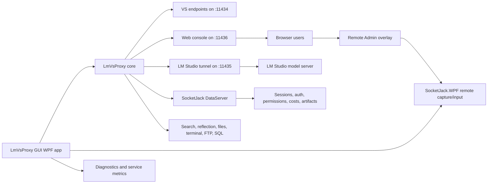

# LmVsProxy GUI


LmVsProxy GUI is the desktop control center for running local AI through LM Studio while presenting OpenAI-compatible and Visual Studio/Copilot-compatible endpoints to local tools, browsers, and remote clients.

It is part diagnostics dashboard, part reverse proxy, part browser chat host, and part admin console. The WPF app starts and monitors `LmVsProxy`, exposes a rich web UI, tracks service health, manages permissions, and can even be remote-controlled from the browser through SocketJack.WPF capture/input support.

## Big Picture

At a glance, LmVsProxy GUI gives you:

| Capability | What it means |
|---|---|
| Local model bridge | Routes Visual Studio, chat-completions clients, and browser chat to LM Studio-compatible models. |
| Web console | Hosts the browser UI at `http://localhost:11436/` with chat, sessions, files, permissions, services, diagnostics, and Remote Admin. |
| VS Copilot endpoints | Publishes local endpoints for `/v1/responses` and `/v1/chat/completions` on port `11434`. |
| LM Studio tunnel | Talks to LM Studio through local port `11435`, with optional remote LM Studio forwarding. |
| Permission system | Gates agent access, internet search, VS tools, uploads, downloads, image input, SQL admin, FTP, and terminal commands per client. |
| Admin workflows | Supports WebAuth users, registration approvals, host-local administration, client mute/ban, terminal approval rules, and filesystem allowlists. |
| Runtime observability | Shows service cards, current pipeline, request counts, bandwidth, GPU/CPU/RAM/IO health, billing settings, debug logs, and active sessions. |
| Remote Admin | Registers the WPF window for web-based screen capture and direct WPF input routing. |
| Tray operation | Can start with Windows, hide to tray, and expose quick tray actions such as opening the web console. |

## Architecture



## Default Ports

| Port | Owner | Purpose |
|---:|---|---|
| `11434` | LmVsProxy | Visual Studio and OpenAI-compatible proxy endpoints. |
| `11435` | LM Studio tunnel | Local LM Studio target used by the proxy. Can be a tunnel to a remote LM Studio host. |
| `11436` | ChatServer | Browser web console, chat UI, admin APIs, file APIs, and Remote Admin APIs. |
| `2121` | FTP | Optional chat/session file transport when enabled. |

The GUI only attempts NAT/port forwarding for `11436` and `2121`. Ports `11434` and `11435` remain local by design.

## Requirements

- Windows, because this is a WPF/Windows Forms tray application.
- .NET SDK capable of building `net10.0-windows7.0`.
- LM Studio with the local OpenAI-compatible server enabled.
- A model loaded in LM Studio.
- Optional: NVIDIA drivers and `nvidia-smi` for richer GPU telemetry.

## Step-by-Step Setup

### 1. Clone and restore

From the repository root:

```powershell
git clone https://github.com/JackOfFates/SocketJack.git
cd SocketJack
dotnet restore .\LmVsProxyGUI\LmVsProxyGUI.csproj
```

### 2. Start LM Studio

1. Open LM Studio.
2. Download or select a local model.
3. Start LM Studio's OpenAI-compatible server.
4. Make sure it listens where LmVsProxy GUI expects it.

For a local setup, the GUI expects the model path through:

```text
http://localhost:11435/v1/chat/completions
```

If your LM Studio server is running somewhere else, use the GUI's **Remote LM Studio** option. Enter a host, `host:port`, or full `http(s)` URL. The app will create a local tunnel:

```text
127.0.0.1:11435 -> remote-host:remote-port
```

### 3. Build the GUI

```powershell
dotnet build .\LmVsProxyGUI\LmVsProxyGUI.csproj
```

### 4. Run the GUI

```powershell
dotnet run --project .\LmVsProxyGUI\LmVsProxyGUI.csproj
```

To start minimized to the tray:

```powershell
dotnet run --project .\LmVsProxyGUI\LmVsProxyGUI.csproj -- --tray
```

### 5. Start the proxy

In the GUI:

1. Click **Probe LM Studio**.
2. Confirm the LM Studio status card turns healthy.
3. Click **Start Proxy**.
4. Confirm the log shows:

```text
VS Copilot endpoint: http://localhost:11434/v1/responses
VS chat-completions endpoint: http://localhost:11434/v1/chat/completions
LM Studio endpoint: http://localhost:11435/v1/chat/completions
Chat UI: http://localhost:11436/
```

### 6. Open the web console

Click **Open Chat UI** or browse directly to:

```text
http://localhost:11436/
```

The web console gives you browser chat, model refresh, service selection, permissions, session history, file uploads, solution explorer, FTP setup, SQL admin access, cost settings, and Remote Admin.


### 7. Point clients at the proxy

For Visual Studio/Copilot-style clients:

```text
http://localhost:11434/v1/responses
```

For OpenAI chat-completions-compatible clients:

```text
http://localhost:11434/v1/chat/completions
```

For browser and LLM client APIs:

```text
http://localhost:11436/
```

### 8. Configure permissions

Open the web console and use **Permissions** to decide what the current client may do.

Common toggles:

- Agent Access
- Internet Search
- VS Copilot Tools
- File Uploads
- Image Uploads
- File Downloads
- FTP Server
- SQL Admin
- Terminal Commands
- Terminal Forever Approved

Host-local clients are treated as administrators. Remote clients should use WebAuth administrator accounts for admin-only actions.

### 9. Enable Remote Admin

Remote Admin lets the browser view and control the WPF GUI.

1. Start the proxy from the desktop GUI.
2. Open the web console.
3. Click **Remote Admin**.
4. Use the overlay to refresh the WPF capture, click the UI, send text, and send keyboard keys.

The app registers the WPF window with `LmVsProxyWpfRemoteControl.RegisterAdminPanel(this)`, so capture and input are provided by SocketJack.WPF. Mouse, wheel, text, and key events are routed directly to WPF window handlers instead of moving the real Windows cursor.


### 10. Optional: run as a background tray app

In the GUI's Application settings:

1. Enable **Start proxy on open**.
2. Enable **Start with Windows**.
3. Enable **Hide to tray** if you want it quiet after login.

The app stores runtime settings beside the executable in:

```text
LmVsProxyGUI.settings.json
```

## Main Screens

| Screen | Use it for |
|---|---|
| Application | Startup behavior, Windows startup, tray behavior, and runtime settings status. |
| Network | Remote LM Studio tunnel, web/FTP port forwarding, and endpoint status. |
| Billing | Storage profile, cost factor, CPU/GPU/RAM/IO estimates, and usage accounting. |
| Sessions | Prompt sessions, active sessions, owner keys, mute/ban/admin actions, and history. |
| Services | Live status cards for web UI, proxy, LM Studio, VS Copilot, agent tools, search, reflection, terminal, FTP, and port forwarding. |
| Solution Explorer | Approved filesystem roots and session files. |
| Debug diagnostics | Event stream, endpoint logs, errors, NAT status, proxy status, and service activity. |

## Web Console Highlights

The browser UI is more than a chat box:

- Streaming chat with cancel/stop support.
- Model refresh from LM Studio.
- Rich code and HTML preview rendering.
- File and image attachments.
- Prompt intellisense for commands and services.
- Session history and session files.
- Permission-gated tools for search, terminal, files, reflection, FTP, SQL, and VS-style operations.
- Remote Admin overlay for the GUI itself.
- Auth and registration flows for remote users.

## Troubleshooting

| Symptom | Check |
|---|---|
| LM Studio probe fails | Start LM Studio's server, verify the model is loaded, and confirm the remote tunnel points to the right host/port. |
| Proxy will not start | Check whether ports `11434`, `11435`, or `11436` are already in use. |
| Web console will not open | Confirm the proxy is started and browse to `http://localhost:11436/`. |
| Visual Studio does not respond | Confirm the client is pointed at `http://localhost:11434/v1/responses` or `/v1/chat/completions`. |
| Remote Admin is blank | Start the desktop GUI, open the web console from an admin-capable client, and click refresh in the overlay. |
| Permissions button is hidden | Use a host-local connection or sign in as a WebAuth administrator. |
| Terminal commands are blocked | Enable Terminal Commands for the owner key, then approve the specific command when prompted. |
| FTP is unavailable | Enable FTP Server permission and configure `/FTP` or the web console's FTP settings. |
| Port forwarding fails | The app uses NAT discovery. Some routers block UPnP/NAT-PMP; local access still works without forwarding. |

## Developer Notes

- Project file: `LmVsProxyGUI.csproj`
- Entry point: `App.xaml.cs`
- Main UI and orchestration: `MainWindow.xaml` and `MainWindow.xaml.cs`
- Core proxy dependency: `..\SocketJack.Windows\SocketJack.WPF.csproj`
- Web UI resource: `SocketJack/Resources/VsLmProxyWebChat.html`
- Settings file: `LmVsProxyGUI.settings.json` in the runtime directory
- Packaged debug output: `bin\Debug\LmVsProxy GUI\`

Useful commands:

```powershell
dotnet restore .\LmVsProxyGUI\LmVsProxyGUI.csproj
dotnet build .\LmVsProxyGUI\LmVsProxyGUI.csproj
dotnet run --project .\LmVsProxyGUI\LmVsProxyGUI.csproj
```

## Security Notes

LmVsProxy GUI can expose powerful local capabilities. Treat it like an admin tool.

- Keep `11434` and `11435` local unless you have a specific reason to expose them.
- Only forward `11436` and `2121` when you intend to serve remote web/FTP clients.
- Use WebAuth administrator accounts for remote administration.
- Be careful with Terminal Forever Approved. It allows repeated command execution for a client.
- Keep filesystem access allowlists narrow.
- Disable Open Registration unless you intentionally want remote users to request or create accounts.

## The Short Version

Start LM Studio, run LmVsProxy GUI, click **Start Proxy**, open `http://localhost:11436/`, and point your AI clients at `http://localhost:11434/v1/responses` or `http://localhost:11434/v1/chat/completions`.

That is the whole machine: model, bridge, browser workspace, admin plane, diagnostics, and remote control in one WPF shell.
