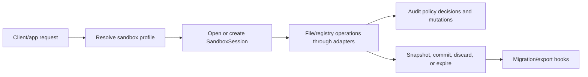

# SocketJack Sandbox Feature Set Plan

Last updated: 2026-05-11

## Goal

Add a reusable SocketJack sandbox component that can isolate filesystem and registry access per app, client, model session, host listing, or Companion work session. The sandbox should support memory-backed operation from a small write overlay through a fully preloaded virtual filesystem, bounded by explicit memory, disk, file, and registry limits.

The first implementation target is SocketJack-owned code paths. Full containment of arbitrary native child processes is planned as a separate compatibility layer because Windows file and registry APIs require a broker, container, or native interception boundary once the process can call Win32 directly.

## Core Outcomes

- Filesystem sandboxing with deny, read-only, redirect, copy-on-write overlay, memory overlay, and full memory modes.
- Registry sandboxing with virtual hives, read-only host passthrough, redirected writes, memory overlay, and snapshot persistence.
- Memory loading that can be metadata-only, lazy block cache, write-layer-only, hot-set preload, full preload, or compressed encrypted snapshot.
- Session-scoped storage so JackLLM chat sessions, master-list sessions, shell relay sessions, and Companion work sessions use one shared storage language.
- Policy and audit hooks suitable for UI approvals, server-side enforcement, and replayable diagnostics.

## Proposed Namespace

`SocketJack.Sandbox`

Primary types:

```csharp
public sealed class SandboxOptions
{
    public string ProfileName { get; set; } = "default";
    public SandboxFileSystemOptions FileSystem { get; set; } = new();
    public SandboxRegistryOptions Registry { get; set; } = new();
    public SandboxMemoryOptions Memory { get; set; } = new();
    public SandboxPersistenceOptions Persistence { get; set; } = new();
    public SandboxLimits Limits { get; set; } = new();
    public SandboxAuditOptions Audit { get; set; } = new();
}

public interface ISandboxSession : IAsyncDisposable
{
    string Id { get; }
    ISandboxFileSystem FileSystem { get; }
    ISandboxRegistry Registry { get; }
    ISandboxAuditLog Audit { get; }
    Task<SandboxSnapshot> SnapshotAsync(CancellationToken cancellationToken = default);
}
```

## Filesystem Model

The sandbox filesystem is an overlay stack. Reads walk from top to bottom, writes land in the configured writable layer, and host paths are visible only through declared mounts.

Layers:

| Layer | Purpose |
|---|---|
| Memory write layer | Fast ephemeral writes, temp files, model outputs, uploaded files before approval. |
| Memory read cache | Blocks or whole files loaded from lower layers under memory limits. |
| Snapshot layer | Persisted session content loaded from a previous sandbox run. |
| Disk spill layer | Overflow when memory limits are reached and spill is allowed. |
| Host bind mount | Explicit real directory or file, optionally read-only or copy-on-write. |
| Deny layer | Blocks reserved paths, credentials, system paths, or tenant-forbidden roots. |

Required behavior:

- Canonicalize paths before policy checks.
- Reject path traversal, alternate data stream abuse, and unsafe relative roots.
- Treat symlinks, junctions, hard links, and reparse points as explicit policy choices.
- Support file IDs and manifests so URLs do not reveal real local paths.
- Support watchers by emitting sandbox change events even when backing storage is memory-only.

## Registry Model

The registry sandbox mirrors the filesystem model with virtual hives:

| Hive Area | V1 Behavior | Later Behavior |
|---|---|---|
| `HKCU\Software\SocketJack\...` | Managed adapter maps to virtual registry store. | Optional real import/export for app compatibility. |
| `HKCU` passthrough | Read-only or denied by policy. | Copy-on-write subtree import for trusted profiles. |
| `HKLM` passthrough | Denied by default, read-only allowlist for diagnostics. | Brokered elevated reads only when approved. |
| Writes | Always land in virtual hive unless explicitly mapped. | Native interception for child processes. |

Required behavior:

- Key/value APIs for strings, binary, DWORD/QWORD, multi-string, and expandable string values.
- Registry snapshots that can be stored as JSON for cross-platform tooling and `.reg` for Windows import/export.
- Per-session diffing so a UI can show "what this app would have changed" before commit.
- Case-insensitive key handling on Windows profiles.

## Memory Loading

Memory mode is not just on/off. The sandbox needs several useful gradients:

- `MetadataOnly`: enumerate paths, sizes, hashes, and timestamps without loading content.
- `LazyBlocks`: load file blocks on demand and evict by LRU.
- `HotSet`: preload declared paths or recent session files.
- `WriteLayerOnly`: keep writes in memory while reads come from lower layers.
- `FullAtStart`: preload the declared sandbox root into memory up to limits.
- `CompressedSnapshot`: hydrate from a compressed encrypted image and keep dirty pages in memory.

When memory limits are reached, policy chooses between failing the write, evicting cache blocks, compressing cold blocks, or spilling to disk.

## Session Lifecycle



Session states:

- `Created`: options validated, storage root reserved.
- `Active`: APIs can read/write.
- `Frozen`: reads continue, writes denied while snapshotting.
- `Committed`: selected changes exported to a durable target.
- `Discarded`: ephemeral layers removed.
- `Expired`: TTL cleanup has run or is pending.

## Implementation Phases

| Phase | Scope | Deliverable |
|---|---|---|
| 0 | Planning and project linkage | This folder and WPF project links. |
| 1 | Contracts and in-memory store | `SandboxOptions`, sessions, in-memory filesystem, virtual registry, quotas, tests. |
| 2 | Overlay and persistence | Bind mounts, copy-on-write, snapshots, manifests, encrypted/compressed images. |
| 3 | SocketJack integrations | JackLLM files, master-list sessions, Companion files, audit events. |
| 4 | UI and admin surfaces | WPF/web panels for sessions, quotas, snapshots, approvals, diffs, cleanup. |
| 5 | Process compatibility layer | Broker/native boundary for arbitrary process filesystem and registry access. |

## Risks And Guardrails

- "Full sandboxing" for arbitrary Windows processes cannot be guaranteed by managed wrappers alone. The plan should state which mode is managed-only and which mode requires brokered process launch or native interception.
- Registry virtualization must avoid silently writing real keys during compatibility fallback.
- Memory-backed files need strict limits by default so a browser upload or model output cannot consume all process memory.
- Real local paths should stay private metadata. Public APIs should use sandbox file IDs, relative names, and download tokens.
- Every migration should run dual-read or dual-write until existing JackLLM and Companion data is proven readable through the new adapters.

## Acceptance Criteria

- A sandbox session can run with no host filesystem writes and still create, read, enumerate, download, snapshot, and discard files.
- A sandbox session can virtualize registry writes and produce a reviewable diff without touching the real registry.
- `SandboxOptions` can express disabled, audit-only, read-only, copy-on-write, memory-only, persistent, and fully denied modes.
- Quota failures are deterministic, audited, and exposed to callers as typed errors.
- JackLLM, SocketJack.com master sessions, and Companion file serving can all map their storage to `SandboxSession` without breaking current URLs during migration.
