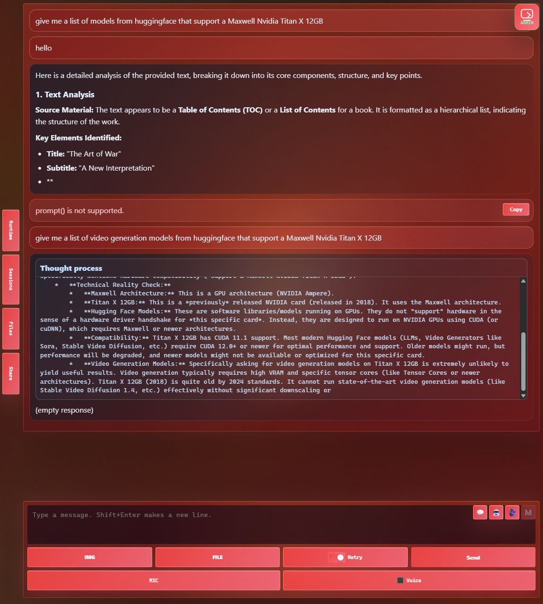
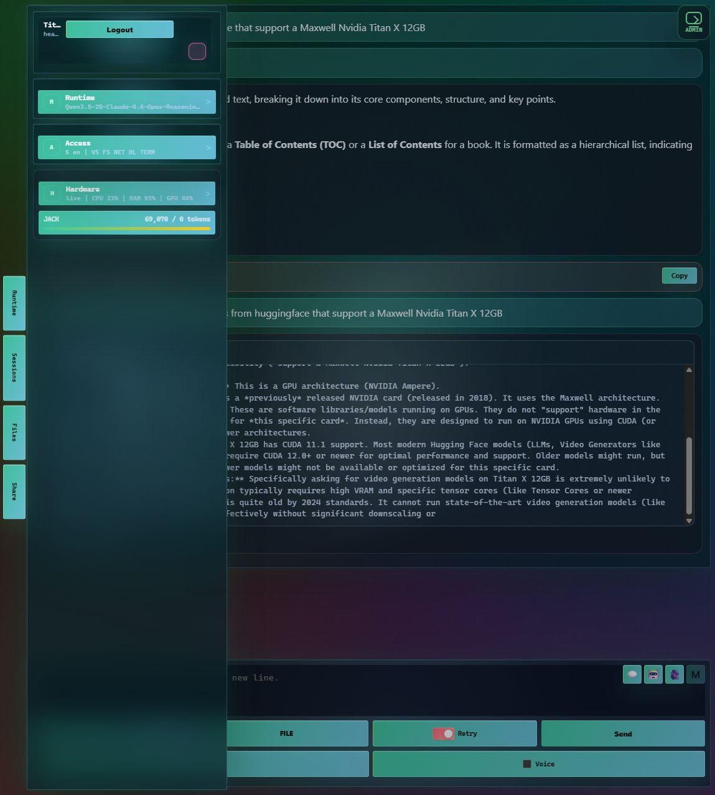
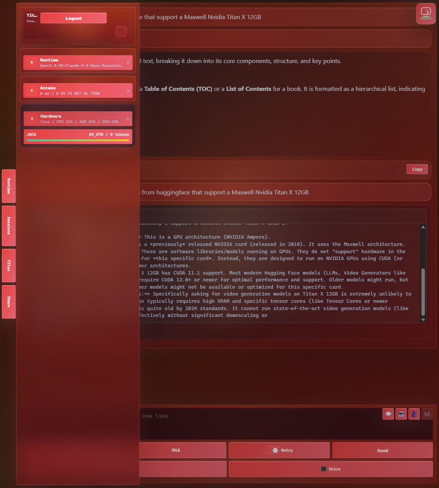

# JackLLM Web Chat UI Example

This example captures the JackLLM Workstation Web Chat UI from the authenticated local browser session. The screenshots were taken from `http://localhost:11436/` after the auth token was consumed, so the page URL shown in the app state does not expose the token.

## Web Chat Overview

The Web Chat session is authenticated as `JACK`, with the selected local model loaded and tool capability detected.

## Chat Mode

Chat mode is the plain assistant experience. It should behave like a chatbot and should not use file, download, terminal, search, or other agent tools.

## Agent Mode

Agent mode is for tool-capable models. In this state, the UI shows the Agent service selected and the available tool permissions, including VS-style file tools, filesystem roots, internet search, downloads, and terminal status.

## Portrait Runtime Tab

In portrait layout, the left rail exposes the `Runtime` tab so model, mode, tool availability, and runtime settings remain reachable.

## Known Current State

These progress bars mirror the current `Plan_B` baseline work items for Chat and Agent mode reliability.

| Area | Progress | Notes |
|---|---:|---|
| Baseline inspection | `[###-------] 30%` | Current code paths and endpoint timings identified. |
| Chat assistant mode | `[#####-----] 55%` | Chat UI works, but plain Chat still needs strict no-tool enforcement. |
| Agent file tools | `[######----] 65%` | Read, write, replace, rename, delete, list, search, and download exist; copy support is still planned. |
| Filesystem boundary safety | `[######----] 60%` | Resolver enforces session and accessible roots; targeted outside-root tests still needed. |
| Downloads | `[######----] 60%` | `download_file` exists; session/UI verification still needed. |
| Thinking panel autoscroll | `[##--------] 20%` | Thinking panel exists; 90% scroll pinning is still planned. |
| Empty response handling | `[#---------] 15%` | `(empty response)` fallback still needs replacement with useful final-state messaging. |
| Load time | `[##--------] 25%` | `/api/models` is the slow path, measured around 2.5 seconds. |
| End-to-end verification | `[#---------] 10%` | Browser smoke tests exist; full Chat/Agent matrix still needed. |

## Load-Time Snapshot

Latest local endpoint sample:

| Endpoint | Status | Time |
|---|---:|---:|
| `/api/models` | 200 | 2488 ms |
| `/api/model-runtime/models` | 200 | 40 ms |
| `/api/chat-services` | 200 | 22 ms |
| `/api/chat-sessions?take=20` | 200 | 31 ms |
| `/api/chat-filesystem-access` | 200 | 20 ms |
